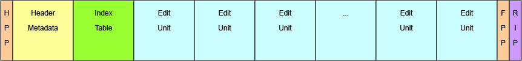
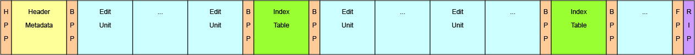

# MXF File Structure and Mapping

## General

SMPTE ST-2117-10 MXF files specified by this document shall have one of the two structures illustrated in Figure 1 and Figure 2 respectively.
**HPP** is an shorthand for Header Partition Pack,
**BPP** is an shorthand for Body Partition Pack and
**FPP** is a shorthand for Footer Partition Pack.

::: {custom-style="smpte-caption"}
Figure 1 - Single Essence Location Style
:::

::: {custom-style="smpte-caption"}
Figure 2 - Multiple Essence Location Style
:::

## Single Essence Location Style

As shown in Figure 1, this style consists of a Header Partition, a Footer Partition, and a Random Index Pack.

The Index Table is placed prior to the Essence Container.

Some of the aspects of this style are shown below.

* It is easy to handle because of a simple structure
* It is easy to edit while file transferring
* It is easy to select an extract, or a “Partial file”

The following Index Layout Properties shall be set according to SMPTE ST 377-1.

* Index Table Segment::Single Index Location TRUE (Single Location)
* Index Table Segment::Single Location TRUE (Single Location)
* Index Table Segment::Forward Index Direction TRUE (Forward)
* Preface:: is RIP present TRUE

## Multiple Essence Location Style

As shown in Figure 2, this style consists of a Header Partition, segmented Body Partition(s),
a Footer Partition, and a Random Index Pack. Each Body Partition carrying VC-6 data
shall be followed by one Index Table Segment that carries the Index Entries for the Edit Units of that Body Partition.

Some of the aspects of this style are shown below.

* It is only necessary to include one Index Table Segment for each Body Partition period on the sender side
* It is easy to perform the function “Play while receiving file” on the receiver side
* It is easy to select an extract, or a “Partial file”

The following Index Layout Properties shall be set according to SMPTE ST 377-1.

* Index Table Segment::Single Index Location FALSE (Distributed Location)
* Index Table Segment::Single Essence Location FALSE (Distributed Location)
* Index Table Segment::Forward Index Direction FALSE (Backward)
* Preface:: is RIP present TRUE
* Essence Container Data:: Following Index Table TRUE (A Complete Index Table follows all Essence)
