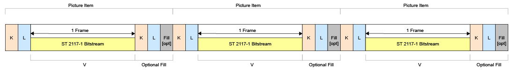

# Mapping VC-6 Bytestream into the MXF Gegneric Container

HEVC streams shall be mapped using the MXF Generic Container using frame wrapping as defined in SMPTE ST 379-1 and SMPTE ST 379-2

Figure 4 shows the SMPTE ST-2117 picture element, the byte stream shall comply with SMPTE ST-2117.

