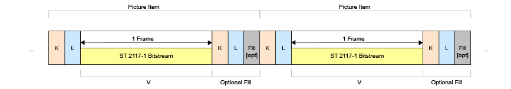

# Mapping VC-6 Bitstream into the MXF Generic Container

VC-6 streams shall be mapped using the MXF Generic Container using frame wrapping as defined in SMPTE ST 379-1 and SMPTE ST 379-2

Figure 4 shows the SMPTE ST-2117 picture element, the bitstream shall comply with SMPTE ST-2117.

::: {custom-style="smpte-caption"}
Figure 4 - Mapping of ST-2117 Picture Item Element
:::
